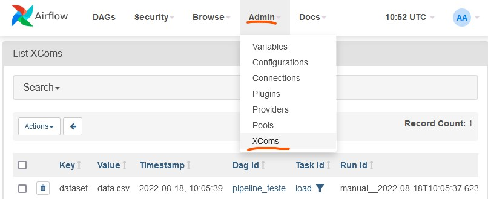

# G1-P4-Airflow
Pipeline Airflow para execução dos algoritmos de inputação de dados ausentes do framework Appraisal.

# Sumário
- [O que é o Airflow?](#o-que-é-o-airflow)
- [Instalação](#Instalação)
  - [Windows](#Windows)
  - [E agora?](#e-agora)
- [Usando o Airflow](#usando-o-airflow)
  - [Construindo um DAG](#construindo-um-dag)
  - [Visualizando e Executando os DAGs](#visualizando-e-executando-os-dags)
  - [Configurando os DAGs](#configurando-os-dags)
  - [Visualizando as XCom](#visualizando-as-xcom)
  - [Vídeo de demonstração da execução do pipeline_teste.py](#vídeo-de-demonstração-da-execução-do-pipelinetestepy)

# O que é o Airflow?
Airflow is a platform created by the community to programmatically author, schedule and monitor workflows. 
# Instalação
## Windows
- [Instale o Docker](https://docs.docker.com/engine/install/)
- [Instale o Docker Compose](https://docs.docker.com/compose/install/)
- Baixe o projeto com o comando 

      git clone https://github.com/PhilippeBrissant/airflow.git
- Entre na pasta \airflow

      cd airflow
- Configure a variável de ambiente. O comando abaixo criará o arquivo .env com os valores das variáveis.

      echo -e "AIRFLOW_UID=$(id -U)\nAIRFLOW_GID=0" > .env
- Compile o container docker com os comandos abaixo. Esse passo pode demorar.

      docker-compose up airflow-init
- Rode o container o comando abaixo. Esse passo pode demorar um pouco.

      docker-compose up

OBS: Nos testes executados, o docker, com os containers rodando, consumiram mais de 8GB de RAM.


## E agora?

Já é possível utilizar o airflow localmente. Acesse localhost:8080 para acessar a aplicação. Logue com **login** ``airflow`` e **senha** ``airflow``. Para mais informações, acesse a [documentação oficial](https://airflow.apache.org/docs/apache-airflow/stable/start/docker.html).

Um bom ponto de partida para entender o airflow é lendo a página [Concepts](https://airflow.apache.org/docs/apache-airflow/1.10.6/concepts.html?highlight=branch%20operator)


**Obs**: caso queira utilizar alguma lib python específica, é necessário adicioná-la na variável de ambiente _PIP_ADDITIONAL_REQUIREMENTS (linha 61) no arquivo [docker-compose.yaml](./docker-compose.yaml). Basta digitar o nome das libs desejadas seguidas de um espaço. 

    _PIP_ADDITIONAL_REQUIREMENTS: ${_PIP_ADDITIONAL_REQUIREMENTS:- scikit-learn pandas numpy}
    
# Usando o Airflow
Um bom ponto de partida para entender o airflow é lendo a página [Concepts](https://airflow.apache.org/docs/apache-airflow/1.10.6/concepts.html?highlight=branch%20operator).

Principais conceitos:
- [DAG (Grafo dirigido acíclico)](https://airflow.apache.org/docs/apache-airflow/1.10.6/concepts.html?highlight=branch%20operator#dags)
- [Operators](https://airflow.apache.org/docs/apache-airflow/1.10.6/concepts.html?highlight=branch%20operator#operators)
  - PythonOperator
  - BranchPythonOperator
  - Sensor
  - BashOperator
- [Task](https://airflow.apache.org/docs/apache-airflow/1.10.6/concepts.html?highlight=branch%20operator#tasks)
  - TaskInstances
- [XCom](https://airflow.apache.org/docs/apache-airflow/stable/concepts/xcoms.html)
- [Variables](https://airflow.apache.org/docs/apache-airflow/stable/concepts/variables.html)

"*By combining **DAGs** and **Operators** to create **TaskInstances**, you can build complex **workflows**.*"

## Construindo um DAG
Todos os dags devem ser arquivos python.py e devem ser salvos em **airflow\dags\\**.

[Exemplo](./dags/exemplo_dag.py) de um DAG:
```
from airflow import DAG
from datetime import datetime
from airflow.operators.dummy import DummyOperator

with DAG(dag_id="meu_dag",
         start_date=datetime(2022, 6, 23),
         schedule_interval="@hourly",
         catchup=False) as dag:
        
    firstTask = DummyOperator(
        task_id="task1"
    )
        
    secondTask = DummyOperator(
        task_id="task2"
    )
        
    thirdTask = DummyOperator(
        task_id="task3"
    )

    firstTask >> secondTask >> thirdTask
```

### Pipeline de teste
Tomemos como exemplo o [pipeline_teste.py](./dags/pipeline_teste.py). A figura abaixo representa esse DAG:


## Visualizando e Executando os DAGs
Se estiver tudo funcionando e o DAG estiver dentro do diretório **\airflow\dags**, basta acessar `localhost:8080` e fazer login com ``airflow`` e **senha** ``airflow``. Clique em *DAGs* e procure pelo seu DAG.


Ao abrir o DAG, clique em *Graph* para ver o grafo (diagrama). Clique no *play* e em *Trigger DAG* para executá-lo.


## Visualizando as XCom
Para visualizar todas as XCom manipuladas durante as execuções dos DAGs, clique no menu ``Admin > XComs``.



## Configurando os DAGs
Nesse nosso exemplo não precisamos, mas é possível também, ao executar um DAG, enviar algumas configurações no formato JSON. Para isso, clique no *play* e em *Trigger DAG w/ config* para executá-lo.


## Vídeo de demonstração da execução do pipeline_teste.py

[](https://www.youtube.com/watch?v=Z1WBhJcU10Q)